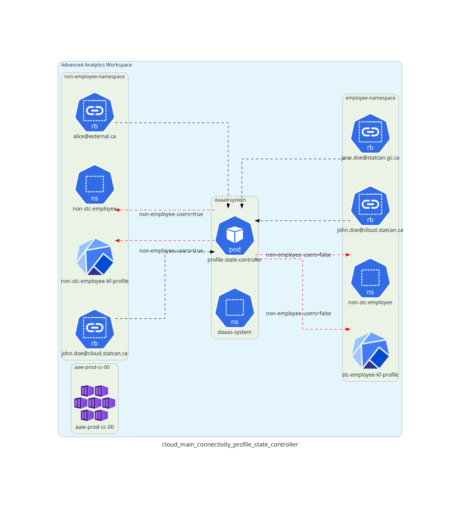
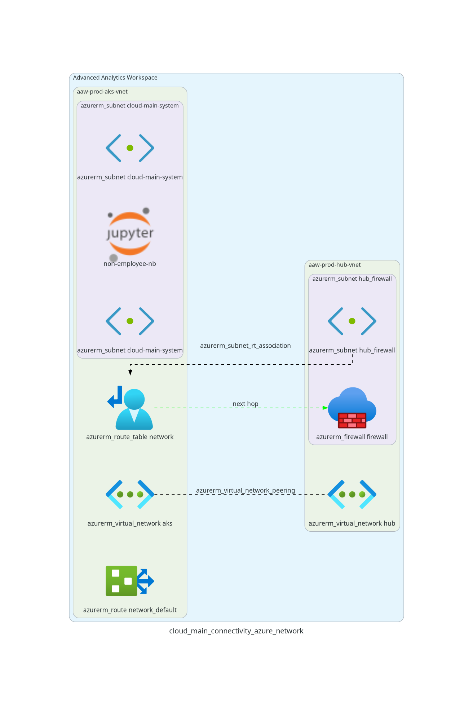

# Overview

Certain users of the AAW platform (e.g. StatCan employees) require access to certain services in our internal cloud environment (e.g. our internal gitlab instance). This documentation page describes the various mechanisms used to enable certain AAW namespaces connectivity to our cloud main environment.

## Related Repositories, Issues, and Pull Requests

- [Repository: Profile State Controller](https://github.com/StatCan/aaw-profile-state-controller)
- [Repository: Gatekeeper Constraints](https://github.com/StatCan/aaw-gatekeeper-constraints/blob/main/deny-external-users/constraint.yaml): exceptions of each category are specified in the parameters of the `DenyExternalUsers` constraint.
- [Repository: Gatekeeper Policies](https://github.com/StatCan/gatekeeper-policies/pull/46): rego policies and tests for
- [Issue: Non-Employee RBAC Model](https://github.com/StatCan/daaas/issues/1335)
- [PR: UDR/Firewall PR to networking module](https://gitlab.k8s.cloud.statcan.ca/cloudnative/aaw/modules/terraform-azure-statcan-aaw-network/-/merge_requests/17)

# Feature Deployment

**Note about Istio Logging**:
> See [Configuring Istio Logging](https://cloudnative.pages.cloud.statcan.ca/en/documentation/monitoring-surveillance/logging/istio/) for more information on how Istio logging is configured. Istio's default log level (`warning`) doesn't show the access logs for this feature, but if you set the log level to `debug`, you can confirm that the correct requests are, in fact, routed through the Istio Egress Gateway.

## Profile State Controller

The `profile-state-controller` watches rolebindings in each kubeflow profile. If a profile only contains role bindings whose subjects' email domains are either `statcan.gc.ca` or `cloud.statcan.ca`, then the profile and corresponding namespace are given the label `state.aaw.statcan.gc.ca/exists-non-cloud-main-user=false`, indicating that there are no non-employee users present in the namespace. If one or more role bindings contain a subject with an email domain other than `statcan.gc.ca` or `cloud.statcan.ca`, the profile and namespace are given the label `state.aaw.statcan.gc.ca/exists-non-cloud-main-user=true`, indicating that there is at least one non-employee user with access to the namespace.

## Istio Egress Gateway

The [`profiles-controller-cloud-main` controller](https://github.com/StatCan/aaw-kubeflow-profiles-controller/blob/main/cmd/cloud-main.go) (deployed in the `daaas-system` namespace) watches namespaces and creates an Istio Virtual Service called `cloud-main-virtualservice` in all namespaces with the label `state.aaw.statcan.gc.ca/exists-non-cloud-main-user=false`, but not in namespaces with the label `state.aaw.statcan.gc.ca/exists-non-cloud-main-user=true`. The virtual service configures the envoy proxies of pods in the employee namespace to route outbound traffic with host matching [a list of allowed hosts](https://github.com/StatCan/aaw-kubeflow-profiles-controller/blob/main/cmd/cloud-main.go#L149-L151) (e.g. `gitlab.k8s.cloud.statcan.ca`) to the `cloud-main-egress-gateway`.

A [special cloud main node pool](https://github.com/StatCan/terraform-azure-statcan-aaw-environment/blob/main/01-infrastructure.tf#L231-L256) is created on the Kubernetes cluster and [assigned a subnet with a distinct IP range](https://github.com/StatCan/terraform-azure-statcan-aaw-network/blob/ce5f4f32bfc72586c9289b4bb62ab9aeeae03b2e/aks.tf#L39-L47). A dedicated Istio egress gateway pod is scheduled to a node from the cloud main node pool, which receives a pod IP from the subnet assigned to the cloud main node pool. This egress gateway pod IP comes from an IP range that is distinct from the subnet of user node pools.

The virtual service deployed into employee-only namespaces configures the envoy proxies on each pod in the namespace to route traffic to `gitlab.k8s.cloud.statcan.ca` to the `cloud-main-egress-gateway`. Therefore, when pods running in employee-only namespaces (containing `gitlab-service-entry`) initiate a request to `gitlab.k8s.cloud.statcan.ca`, the request is routed through the `cloud-main-egress-gateway`, which will have an outgoing IP associated with one of the `cloud-main-system` nodes. When pods running in namespaces that contain an external employee (not containing `gitlab-service-entry`), requests to `gitlab.k8s.cloud.statcan.ca` will not be routed through the `cloud-main-egress-gateway`, and therefore will have an outgoing IP address associated with a user node.

In the cloud main boundary firewall, a rule can be put in place to only allow incoming TCP traffic on ports 443 or 22 originating from the `cloud-main-egress-gateway` IP address; requests originating from user pod IPs will be blocked at the firewall level.

In each employee-only namespace, network policies must be added that allow egress to the `cloud-main-system` namespace. A corresponding network policy based on a namespace label selector (see e.g. description posted in  https://github.com/StatCan/daaas/issues/1097#issue-1234409276) must be added to the `cloud-main-system` namespace to allow ingress from employee-only namespaces.

The green arrow in the diagram below shows the route taken by requests to `gitlab.k8s.cloud.statcan.ca` from employee-only namespaces, while the red arrow shows the route taken by requests to `gitlab.k8s.cloud.statcan.ca` from namespaces with at least one non-employee users.

## Azure Networking

Several Azure components need to be configured through Terraform.

> TODO

## Attribution

- Jupyter Icon borrowed from [wikimedia commons](https://commons.wikimedia.org/wiki/File:Jupyter_logo.svg)