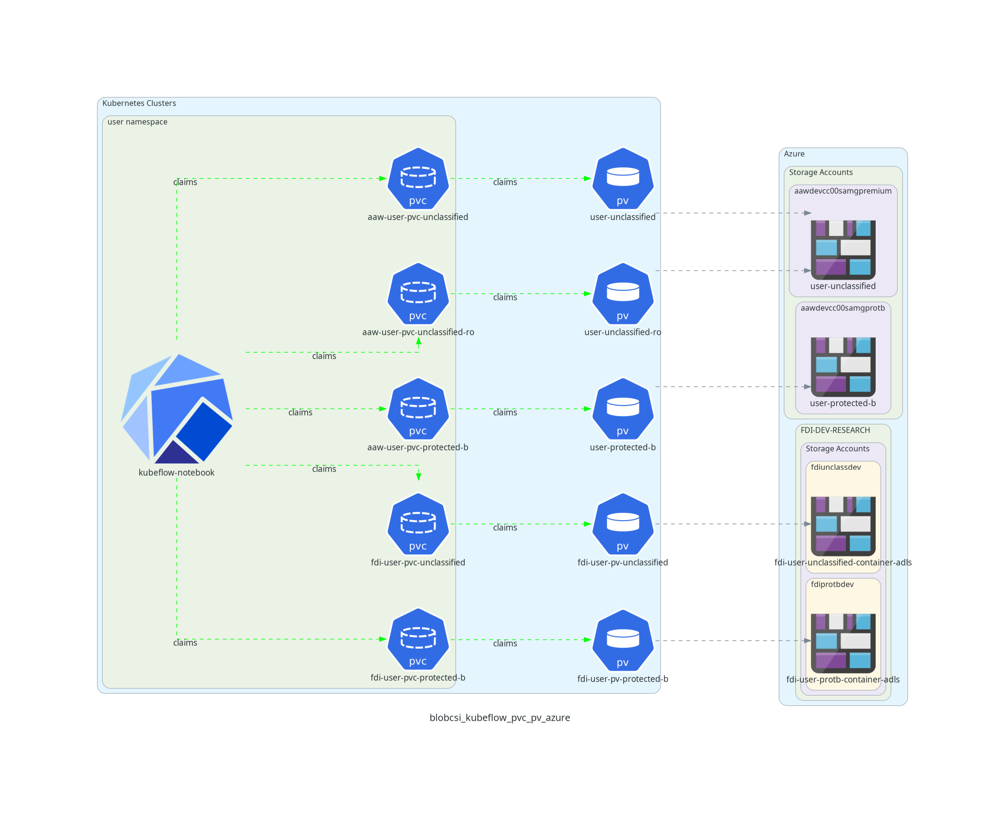

# Overview
The blob-csi system is the replacement system for the [minio storage solution in AAW](https://github.com/StatCan/aaw-argocd-manifests/tree/aaw-dev-cc-00/storage-system/kustomize-gateway#minio-gateway).

In order to provide AAW users with access to Azure storage containers, we deploy a storage solution consisting of the following components:

- [azure blob-csi-driver](https://github.com/kubernetes-sigs/blob-csi-driver): responsible for mounting `PersistentVolume` resources
to azure storage containers via [blob-fuse](https://github.com/Azure/azure-storage-fuse)
  - [deployed by argocd into AAW here](https://github.com/StatCan/aaw-argocd-manifests/blob/aaw-dev-cc-00/daaas-system/blob-csi-driver/application.yaml)
- [blob-csi-injector](https://github.com/StatCan/aaw-blob-csi-injector): `MutatingWebhook` which is responsible for adding `Volumes` and
`VolumeMounts` to pods containing the `data.statcan.gc.ca/inject-blob-volumes` label.
  - [deployed by argocd into AAW here](https://github.com/StatCan/aaw-argocd-manifests/blob/aaw-dev-cc-00/daaas-system/blob-csi-injector/manifest.yaml)
- [blob-csi.go kubernetes controller](https://github.com/StatCan/aaw-kubeflow-profiles-controller/blob/main/cmd/blob-csi.go):
Responsible for the provisioning of Azure storage containers, `PersistentVolume`s and `PersistentVolumeClaim`s per namespace for AAW users.
  - [deployed by argocd into AAW here](https://github.com/StatCan/aaw-argocd-manifests/blob/aaw-dev-cc-00/daaas-system/profile-controllers/profiles-controller/application.jsonnet)


# Feature Implementation
The blob-csi system allows users to gain access to Azure container storage at unclassified and protected-b classification levels.
Currently, users can mount volumes manually as data-volumes in AAW's Kubeflow notebook creation workflow, but eventually
auto-mounting of volumes will be supported.

Note that the figures depicted below are representative of the AAW development Kubernetes cluster. However; the implementation in
production is near identical, with the only difference being the use of the word `dev` being replaced with `prod` throughout the resources.

The data flow for how a kubeflow notebook will connect to backing storage at a high level is provided below.



In short, users request a data volume for use within their kubeflow notebook, the `blob-csi-driver` runs a `csi-controller pod` on each
node in the cluster, and each `csi-controller pod` mounts any volumes requested.

## The blob-csi.go Kubernetes Controller
The [blob-csi.go kubernetes controller](https://github.com/StatCan/aaw-kubeflow-profiles-controller/blob/main/cmd/blob-csi.go) is responsible
for the creation of `PersistentVolume`, `PersistentVolumeClaim` and azure storage containers per user namespace in AAW. In addition, the
controller must monitor a permissions list obtained through `OPA` gateways which serve a list of azure containers and who can be a reader/writer for each container. The permissions lists are managed by `Fair Data Infrastructure team (FDI)`.

AAW default volumes are configured [here](https://github.com/StatCan/aaw-argocd-manifests/blob/aaw-dev-cc-00/daaas-system/profile-controllers/profiles-controller/application.jsonnet#L62-L64)
and any change to the `name` field will result in the deletion and re-creation of `PersistentVolume` and `PersistentVolumeClaim` resources
to reconcile the change. There are two possible classifications for volumes: `unclassified` and `protected-b`. Notice that the
`unclassified-ro` classification is `protected-b`. This is so that users can view `unclassified` data within a `protected-b` pod (volume classifications are enforced by `Gatekeeper` upon creation of a notebook).

In order for the controller to determine which `PersistentVolume`s and `PersistentVolumeClaim`s to create for `FDI` containers,
the controller queries `unclassified` and `protected-b` `OPA` gateways `pod`s via `http` requests, recieving a `.json` formatted response.
An example of the expected `.json` formatted response from an `OPA` gateway is included below:

```json
{
    "container1": {
        "readers" : ["alice", "bob"],
        "writers" : ["bob"]
    }
}
```
In the above example, the controller would provision a `PersistentVolume` and `PersistentVolumeClaim` for both `alice` and `bob`, however
`alice` would have `ReadOnlyMany` permissions, and bob would have `ReadWriteMany` permissions.

# Architecture Design

For more context on the blob-csi system as a whole (from deployment of infrastructure to azure containers), see the attached diagram below.
In addition, refer to the below legend for line types and colours.

- Line types:
  - Solid lines follow the paths of the deployment or provisioning of resources.
  - Dashed lines outline the paths for connectivity.
- Line Colours:
  - Navy blue lines are used for edges connecting nodes within the kubernetes cluster.
  - Light green lines are assiciated with kubeflow from a users perspective.
  - Yellow lines are associated with argocd.
  - Purple lines are associated with terraform.
  - Light blue lines are associated with edges that connect from nodes anywhere in the diagram to an azure resource.


